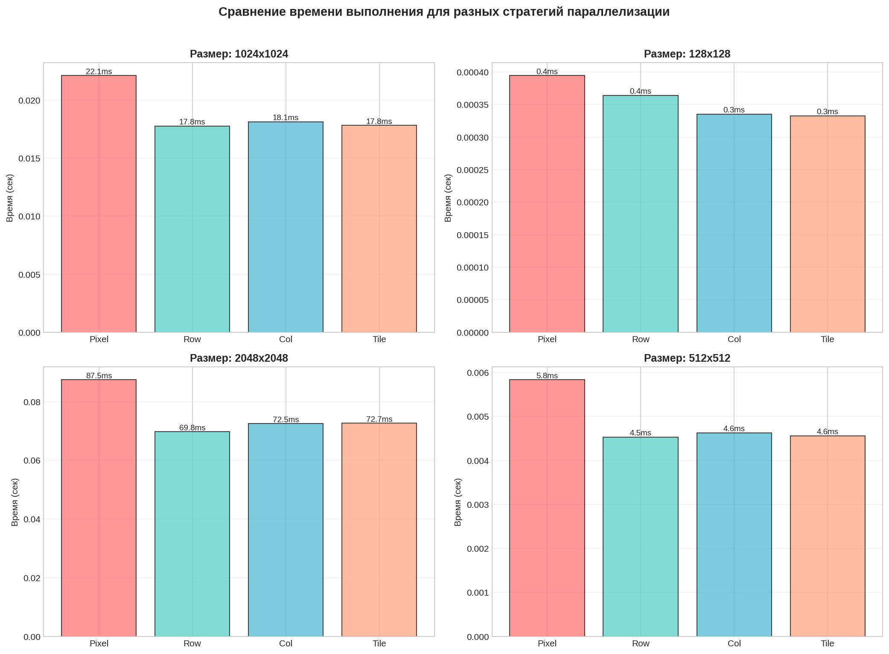
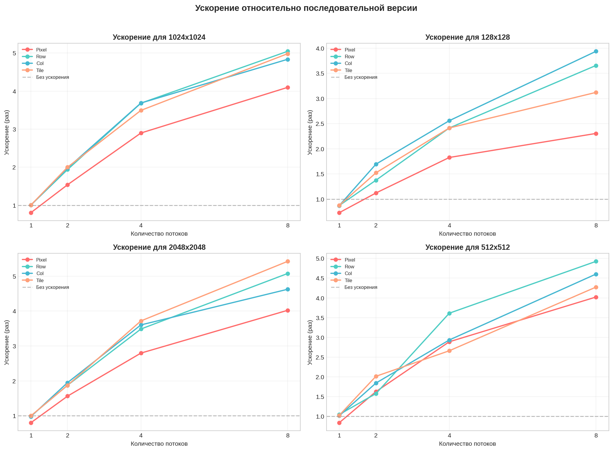
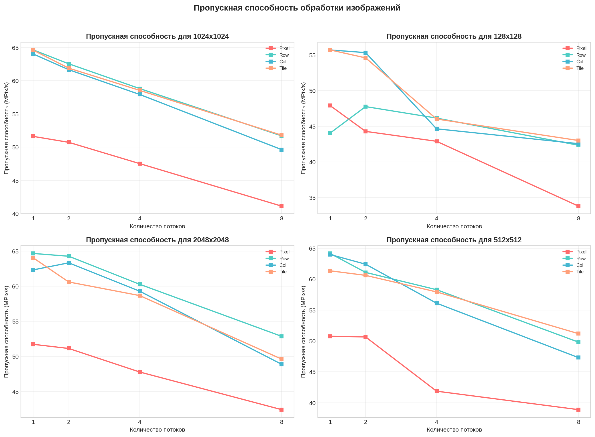
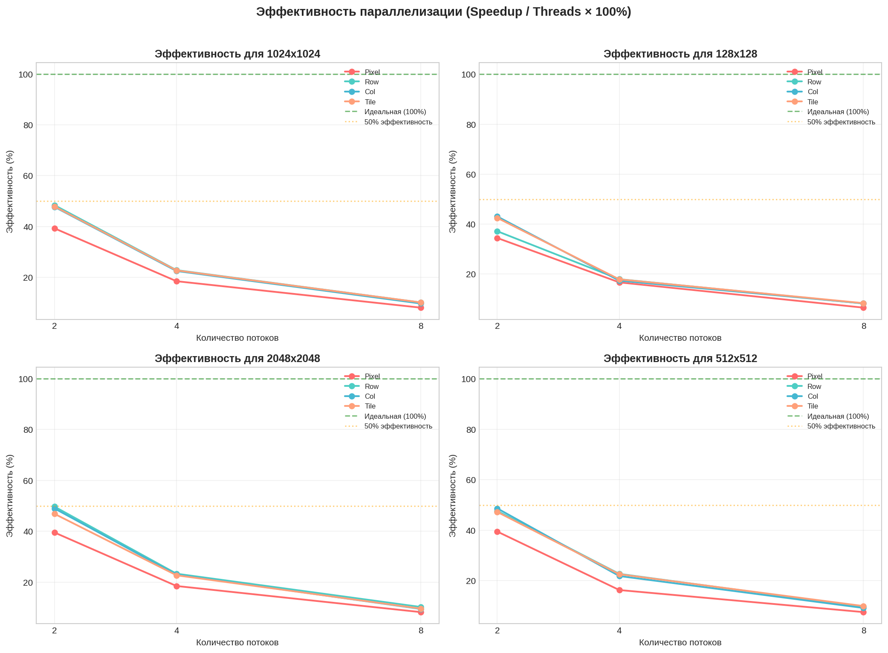

# Задача 2

Реализация параллельной свёртки изображений с различными стратегиями распараллеливания на C с использованием OpenMP.

##  Использование
```bash
make all # сборка проекта
make test # запуск тестов для различных фильтров и стратегий параллелизации
make run # сборка и запуск с настройками по умолчанию
make clean # очистка
make help # справка
# запуск исполняемого файла
./build/convolution_seq
```


### Стратегии параллелизации

| Стратегия | Описание |
|-----------|----------|
| **Sequential** | Последовательная обработка (эталон) |
| **Pixel** | Распределение отдельных пикселей между потоками |
| **Row** | Распределение строк изображения между потоками |
| **Column** | Распределение столбцов между потоками |
| **Tile** | Разбиение на прямоугольные плитки (32×32) |

## тестовое окружение
|  |  |
|---------|---------|
| **CPU** | 12th Gen Intel(R) Core(TM) i7-12700H |
| **RAM** | 16 ГБ |
| **ОС** | Arch Linux x86_64 |


### Зависимости
- GCC или Clang с поддержкой OpenMP
- Библиотека stb_image для загрузки/сохранения изображений

## График 1

Pixel — самая медленная стратегия во всех размерах изображений. Разница особенно заметна на больших размерах (1024×1024 и 2048×2048).
Row, Col и Tile показывают очень близкие результаты и значительно превосходят Pixel.
На маленьких изображениях (128×128 и 512×512) различия между Row/Col/Tile минимальны.
На больших изображениях (1024×1024 и особенно 2048×2048) Row и Tile демонстрируют небольшое преимущество перед Col.

## График 2

Pixel показывает самое слабое ускорение на всех размерах и при любом количестве потоков.
Row, Col и Tile дают сопоставимое ускорение, близкое к линейному на малом числе потоков.
С ростом количества потоков (особенно 4→8) наблюдается заметное падение эффективности у всех стратегий, что говорит о наличии overhead и/или проблем с масштабируемостью.
На больших изображениях (2048×2048) Row и Tile сохраняют лучшее ускорение.
Row и Tile обеспечивают наиболее стабильное и высокое ускорение.

## График 3

Pixel значительно уступает остальным стратегиям по пропускной способности на всех размерах изображений.
Row, Col и Tile показывают почти одинаковую высокую пропускную способность.
На изображениях среднего и большого размера (1024×1024, 2048×2048) Row часто показывает наилучший результат.


## График 4

Эффективность у всех стратегий падает с увеличением количества потоков.
Pixel демонстрирует самую низкую эффективность параллелизации.
Row, Col и Tile имеют близкую эффективность, особенно на 4 и 8 потоках.


# Общие выводы
стратегия pixel уступает другим во всём.
Наиболее эффективные стратегии: Row и Tile.
Row чаще показывает лучше результаты чем Tile.
