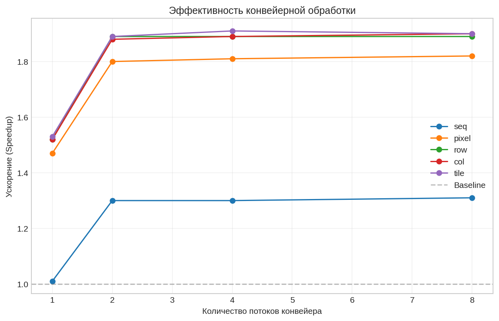
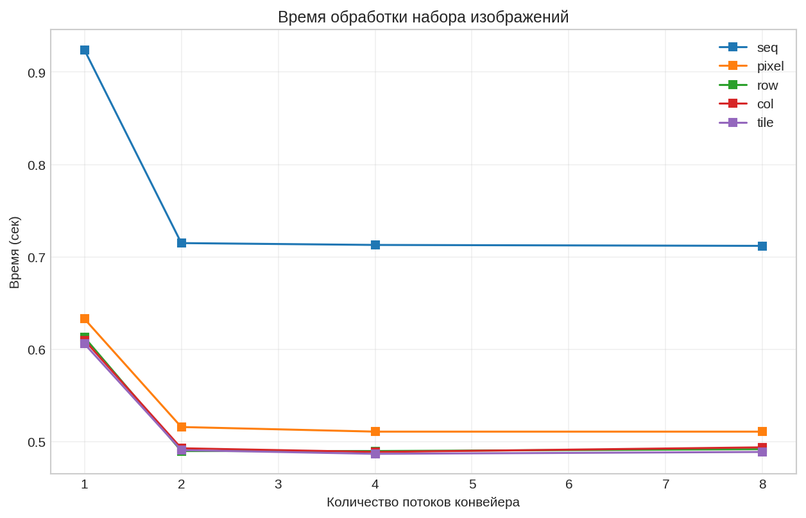

# Задача 3

Реализация параллельной свёртки изображений с различными стратегиями распараллеливания на C с использованием OpenMP.

##  Использование
```bash
make all # сборка проекта
make test # запуск тестов для различных фильтров и стратегий параллелизации
make run # сборка и запуск с настройками по умолчанию
make stream # сборка и запуск потоковой обработки изображений
make clean # очистка
make help # справка
# запуск исполняемого файла
./build/convolution_seq
./build/stream_conv
```


### Стратегии параллелизации

| Стратегия | Описание |
|-----------|----------|
| **Sequential** | Последовательная обработка (эталон) |
| **Pixel** | Распределение отдельных пикселей между потоками |
| **Row** | Распределение строк изображения между потоками |
| **Column** | Распределение столбцов между потоками |
| **Tile** | Разбиение на прямоугольные плитки (32×32) |

## тестовое окружение
|  |  |
|---------|---------|
| **CPU** | 12th Gen Intel(R) Core(TM) i7-12700H |
| **RAM** | 16 ГБ |
| **ОС** | Arch Linux x86_64 |

## График 1

Ускорение относительно базовой линии быстро достигает максимума (~1.9×) уже при 2-3 рабочих потоках и стабилизируется,

## График 2

Время резко снижается при переходе с 1 на 2 потока, после чего выходит на плато и практически не меняется до 8 потоков из-за ограничений в ядрах и накладных расходов


# Общие выводы
Конвейерная архитектура эффективно масштабируется только до 2–3 рабочих потоков, достигая потолка ускорения ~1.9×, после чего дополнительные потоки и выбор внутренней стратегии свёртки перестают влиять на производительность. Эффективность стратегий практически одинаковая, за исключением pixel, которая показывает заметно худшие результаты.
